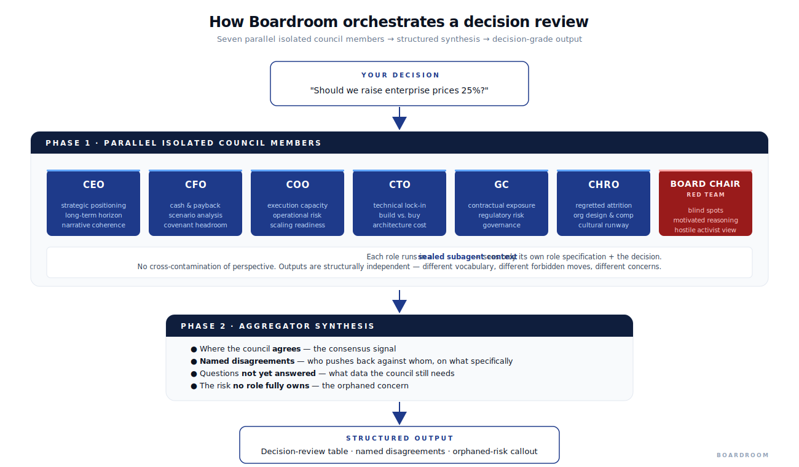
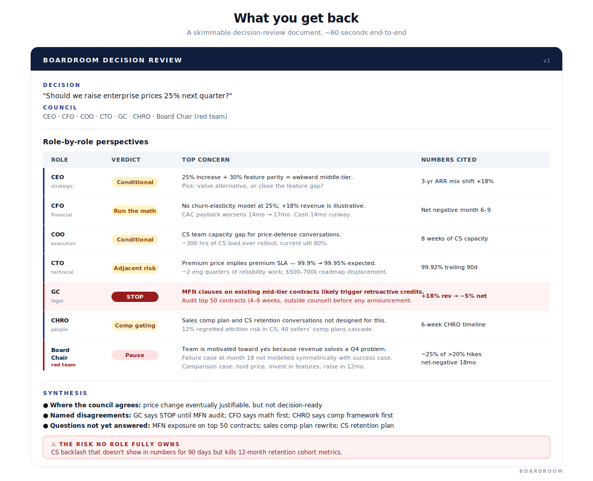

# Boardroom

> Run any business decision through a multi-stakeholder council — CEO, CFO, COO, CTO, General Counsel, CHRO, and a Board Chair acting as red team. Each role runs in a sealed context. Each surfaces what the others miss.

A **Claude Skill** plus a **portable prompt** that works in any LLM. No Python, no infrastructure, no setup. Type a decision; get back the perspectives a single decision-maker tends to miss.

> **The people lens is gating in nearly every substantive business decision** — pricing changes affect CS team capability and sales comp; M&A is a people decision masquerading as a financial one; international expansion is a hiring problem with regulatory wrapping; technical decisions create senior-IC retention issues. v1 puts [CHRO](./roles/chro.md) in the default council alongside the 5 operational lenses and the Board Chair red team — 7 roles by default, not 6.

[](https://www.apache.org/licenses/LICENSE-2.0)
[](https://docs.claude.com/en/docs/agents-and-tools/skills)
[](./boardroom-portable.md)
[](#)




**Jump to:** [Why this exists](#why-this-exists) · [30-second demo](#see-it-in-action--the-30-second-demo) · [How it works](#how-it-works-in-two-phases) · [Quick start](#quick-start) · [Council presets & expansion](#council-presets-and-expansion-roles) · [Customize](#customize-in-30-seconds) · [FAQ](./docs/faq.md)

---

## Why this exists

Every leader makes high-stakes decisions in their own head — or with a homogeneous group that thinks too much like them. The two failure modes are equally common:

- **Single-perspective blindness:** the founder who decides alone, sees the upside, misses the legal exposure
- **Council groupthink:** the executive team that rubber-stamps because everyone is socially aligned

Both produce decisions that read well in the moment and fail expensively six months later. The remedy isn't more meetings — it's structurally enforced multi-perspective review with named disagreement.

Boardroom does that, in 60 seconds, in any LLM.

---

## See it in action — the 30-second demo

**Decision:** *"Our enterprise SaaS plan is $2,000/user/month. Competitor X just raised theirs to $3,500. Should we raise ours to $2,500 for new contracts and renewals over the next 6 months?"*

**Without Boardroom (single-perspective thinking):**

> Market supports a higher price. We're 30% below the new competitor benchmark. Let's raise to $2,500 — start with new logos and roll to renewals over Q2-Q3.

That's the answer most operators arrive at in 90 seconds. It's *not wrong*, but it's *incomplete*.

**With Boardroom (seven-role council, structurally enforced):**

| Role | Verdict | What they surface |
|------|---------|-------------------|
| **CEO** | Not yet | "25% increase with 30% feature parity puts us in awkward middle-tier. Either close the feature gap to support the price, or hold price as the value play. What's the strategic story?" |
| **CFO** | Run the math | "+18% revenue impact at 8% logo churn assumption — but new-logo CAC payback worsens by ~3 months. Net cash position better at month 18, worse at month 6-9. Cash runway?" |
| **COO** | Conditional | "Customer Success team gets harder calls. Are CS reps trained for hard negotiation? 60-day CS readiness plan needed before announcing." |
| **CTO** | Adjacent risk | "Higher price = higher uptime expectations. Premium price triggers premium SLA. Is technical debt prioritized?" |
| **GC** | **STOP** | "Most enterprise SaaS contracts have most-favored-nation (MFN) clauses or price-protection language. A 25% increase often triggers retroactive obligations to existing mid-tier customers. Have you audited top 50 contracts? This could turn +18% revenue into -5% net effect." |
| **CHRO** | Comp gating | "Sales comp plan and CS retention conversations aren't designed for this. 12% regretted-attrition risk in CS before this even reaches a customer; 40 sellers' comp plans cascade. 6-week CHRO timeline minimum, comp framework rewrite first." |
| **Board Chair** ⚔ | Pause | "What's the failure case at month 18? Are you structurally biased toward yes because revenue solves a Q4 problem? Verify CS readiness AND MFN exposure AND comp plan rewrite before committing." |

**Synthesis:**
- *Where the council agrees:* Pricing change is justifiable; value math works
- *Named disagreements:* GC says STOP, CFO says calculate first, CHRO says comp framework first, Red Team flags structural bias
- *The questions not yet answered:* MFN exposure on top 50 contracts, sales comp plan rewrite, CS retention plan
- *The risk no role fully owns:* customer success backlash that doesn't show in numbers for 90 days

**The single most important thing Boardroom surfaced:** the General Counsel's MFN clause concern. Most operators forget about MFN exposure when planning price changes. That single question can flip a +18% revenue decision into a -5% net effect.

That's the difference between "decision made in 90 seconds" and "decision made well."



**Four full worked examples** — each shows the default 7-role council in action across a different decision type:

| # | Decision | Lead voice | What CHRO uniquely surfaces |
|---|----------|------------|------------------------------|
| [01](./examples/01-pricing-decision.md) | Enterprise SaaS pricing change (+25%) | GC (MFN exposure gating) | Sales comp plan precedent + CS regretted-attrition risk |
| [02](./examples/02-acquisition-evaluation.md) | $30M acquisition with 30% earn-out | GC + CFO + Board Chair | Senior-team retention package + comp harmonization + leveling |
| [03](./examples/03-international-expansion.md) | UK office launch ($5M Y1) | CEO + CFO | UK hiring timeline reality + comp band harmonization + cultural runway |
| [04](./examples/04-rto-policy-decision.md) | Mandatory 3-day return-to-office | **CHRO** (people-led) | Segmented regretted attrition + cultural runway + decision-space reframing |

---

## How it works (in two phases)

Boardroom is built on a simple but load-bearing architectural pattern:

**Phase 1 — Parallel isolated council members.** Each role runs in a *sealed context* — Claude only sees that role's specification (its mandate, decision lens, forbidden moves, vocabulary, personality) plus the decision. No cross-contamination. The CFO doesn't know what the CEO is thinking; the GC doesn't know what the COO is thinking. They produce structurally independent perspectives.

This isolation is what prevents the single failure mode of multi-agent prompting: outputs converging to "thoughtful executive voice" regardless of role. With sealed contexts and explicit forbidden moves, the CFO sounds like a CFO and the General Counsel sounds like a General Counsel — because each is asking only its own role's questions of its own role's specification.

**Phase 2 — Aggregator synthesis.** A separate aggregator pass receives all seven role perspectives (more if you've added an optional expansion role; fewer if you've defined a custom council) and produces structured output: where the council agrees, named disagreements (CFO vs. CHRO, GC vs. CEO, etc.), questions not yet answered, and the risk no single role fully owns.

This is the [orchestrator-worker pattern](https://www.anthropic.com/research/building-effective-agents) from Anthropic's *Building Effective Agents* guidance — applied to business decision review instead of code generation.

[Full architectural detail →](./docs/how-it-works.md)

---

## Quick start

### Option 1 — Anthropic Skill (Claude Code, Claude Desktop, Cowork)

Clone the repo into your skills directory:

```bash
git clone https://github.com/teemutuo/boardroom_skills ~/.claude/skills/boardroom
```

Restart your Claude environment. Then in any conversation:

```
boardroom: should we raise enterprise prices 25% next quarter?
```

Boardroom triggers automatically. The council runs. You get the structured output in under 60 seconds.

**Other invocation patterns:**

```
boardroom CFO: should we raise enterprise prices 25%?      # single-role deep dive
boardroom CHRO: should we mandate 3-day RTO?               # single-role deep dive on a people decision
boardroom council m-and-a: should we acquire Acme?         # preset council
boardroom council restructuring: should we mandate 3-day RTO?  # preset council, CHRO as lead voice
boardroom CEO, CFO, CHRO, GC, Board Chair: <decision>      # explicit composition (subset of the default 7)
```

### Option 2 — Portable prompt (Claude.ai, ChatGPT, Gemini, Copilot)

No skill installation, no setup. Open [`boardroom-portable.md`](./boardroom-portable.md), copy the entire contents, paste into your LLM of choice, then add your decision below it. Same architecture, same default 7 roles (CHRO included), same structured output — just delivered through prompt engineering instead of skill orchestration.

Use the portable version for quick share-with-a-friend demos. Use the Skill version for sustained use.

---

## Council presets and expansion roles

The default 7 cover most business decisions. For repeated decision contexts (acquisitions, restructurings) you want a pre-configured council instead of typing the role list each time. For decisions requiring a dimension outside the default 7 (deep product, deep sales motion, deep security), optional expansion roles are available.

### Council presets shipping in v1

Pre-configured compositions. Invoke with `boardroom council <name>: <decision>`.

| Council | Composition | Lead voice | Best for | Worked example |
|---------|-------------|------------|----------|----------------|
| [`m-and-a`](./councils/m-and-a.md) | Default 7 | GC (gating) + CFO + CHRO + Board Chair | Acquisitions, divestitures, mergers | [Example 02](./examples/02-acquisition-evaluation.md) |
| [`restructuring`](./councils/restructuring.md) | Default 7 | **CHRO** | Layoffs, reorganizations, RTO mandates, comp framework changes | [Example 04](./examples/04-rto-policy-decision.md) |

Define your own preset by adding `councils/<name>.md` listing the role composition and any context for the aggregator. See the [customization guide](./docs/customization.md#path-3--custom-council-compositions-10-minutes) for the format.

### Optional expansion roles (planned v1.1)

These ship empty in v1 — the default 7 cover the high-frequency decisions. Use the [CHRO file](./roles/chro.md) as the structural template if you want to author one of these before v1.1 lands. PRs welcome.

| Role | Domain | Best for |
|------|--------|----------|
| CPO | Product, customer value, roadmap | Product launches, feature prioritization, customer-strategy |
| CRO | Pipeline, sales motion, pricing economics | Pricing changes, GTM model, sales-team scaling |
| CISO | Security, compliance, threat surface | Vendor risk, data-handling, regulatory exposure |

---

## What's in the box

```
boardroom/
├── SKILL.md                          # Anthropic Skill definition + orchestration
├── boardroom-portable.md             # Single-prompt portable version (default 7-role)
├── roles/
│   ├── _index.md                     # Role catalog
│   ├── ceo.md                        # Strategic positioning, narrative coherence
│   ├── cfo.md                        # Cash, payback, scenario analysis
│   ├── coo.md                        # Execution, capacity, operational risk
│   ├── cto.md                        # Architecture, technical lock-in, build/buy
│   ├── general-counsel.md            # Contractual, regulatory, governance
│   ├── chro.md                       # People, org design, total rewards, cultural runway
│   ├── board-chair.md                # Devil's advocate / red team
│   └── _optional/
│       └── README.md                 # CPO / CRO / CISO planned for v1.1
├── councils/
│   ├── m-and-a.md                    # Council preset for acquisitions
│   └── restructuring.md              # Council preset for org / RTO / layoff decisions
├── output-formats/
│   └── structured-table.md           # Default output format
├── examples/
│   ├── 01-pricing-decision.md        # Enterprise SaaS pricing change
│   ├── 02-acquisition-evaluation.md  # M&A consideration
│   ├── 03-international-expansion.md # UK office launch
│   └── 04-rto-policy-decision.md     # Return-to-office mandate (CHRO-led)
├── docs/
│   ├── how-it-works.md               # Architecture explained
│   ├── customization.md              # Add roles, edit specs, custom councils
│   └── faq.md
├── assets/
│   ├── architecture.svg
│   └── output-preview.svg
└── LICENSE                           # Apache 2.0
```

---

## What makes the role outputs distinct (the structurally enforced part)

Most multi-agent persona libraries fail the *blind-role test*: strip the role names from the outputs, show them to a peer, and they can't tell which output came from which role. The roles all sound like ChatGPT in different suits.

Boardroom passes this test through one architectural choice plus four load-bearing mechanisms baked into every role file:

**Architectural:** sealed context per role — each role-Claude only ever sees its own role spec, never the other roles' specs or outputs.

**Per role file:**

1. **Forbidden moves.** Each role explicitly declares behaviors *out of character* — what it won't do, what vocabulary it won't use. The CFO won't say "exciting opportunity"; the General Counsel won't recommend speed over diligence; the Board Chair won't go along with consensus.
2. **Quantitative anchors.** Each role *must* cite at least one specific number or threshold per output. CFO cites payback periods and covenant headroom; GC cites contractual exposure as a percentage of revenue; COO cites cycle times and capacity utilization.
3. **Vocabulary banks.** Each role specifies words it uses (and doesn't). Enforces voice differentiation at the language level.
4. **Mandatory dissent.** Every role must identify at least one disagreement with another role's perspective per decision review. Forces structural disagreement; prevents homogenized "everyone agrees" outputs.

Combined, these prevent the homogenization that kills most multi-agent persona work. With sealed contexts, the CFO talks payback periods and covenant headroom. The GC talks contractual exposure and regulatory surface. The Board Chair acts adversarial. They sound different because they are different.

---

## Customize in 30 seconds

**To match your real CFO's personality** — open `roles/cfo.md`, edit the OCEAN trait lines (Openness HIGH/MEDIUM/LOW, etc.) and the vocabulary bank. Save. Done.

**To add a new role** — copy any role file, rename it (e.g., `roles/founder.md`), edit the 13 sections to match the perspective you want simulated. The role becomes available immediately by name: `boardroom Founder: [decision]`.

**To create a custom council** — for repeated decision contexts (M&A reviews, product launches, restructuring), define a named council in `councils/[name].md` listing roles. Then `boardroom council product-launch: [decision]` invokes that pre-set composition.

[Full customization guide →](./docs/customization.md)

---

## What it doesn't claim to do

Boardroom is honest about its limits — and they matter:

- **It is not a substitute for actual stakeholder conversations.** It surfaces structural perspectives; the real people may disagree, have private context, or care about things the role spec doesn't cover.
- **Outputs are inputs to decisions, not decisions.** The council surfaces concerns and questions; you (or your real council) make the call.
- **It simulates archetypal role behavior, not specific real people.** Your actual CFO might be wildly different from the default INTJ-flavored one. Edit the role file to match.
- **It does not replace red-team review at the highest stakes.** For decisions where being wrong is catastrophic, supplement Boardroom output with adversarial human review.

These limits are intentional. The value is in surfacing the perspectives a single decision-maker tends to miss — not in pretending the simulator knows your business better than you do.

---

## License and contributions

**Apache 2.0** — use freely, fork freely, ship inside other tools freely.

This is an opinionated artifact, not a community framework. Contributions welcome via PR, but the vision is held — not every contribution will be merged. See [the customization guide](./docs/customization.md#sharing-your-customizations) before opening a major PR — the contribution patterns and what does/doesn't get merged are documented there.

---

## Author

Built by [Teemu Tuovinen](https://www.linkedin.com/in/teemu-tuovinen/) — finance leader operating at the intersection of strategy, data, and technology. The architectural idea (multi-agent role-spec simulation for decisions) is something I think about a lot. Boardroom is the simplest, generic, open-source version that works for anyone making multi-stakeholder decisions.

If you find it useful, consider:
- ⭐ Starring the repo
- Sharing your customization (PRs welcome on `roles/_optional/`)
- Sending me what surprised you ([LinkedIn DM](https://www.linkedin.com/in/teemu-tuovinen/))

---

## Four things to try next

1. [Read the worked example on enterprise pricing →](./examples/01-pricing-decision.md) — see the GC's MFN clause concern flip a +18% revenue decision into −5% net effect
2. [See the CHRO-led return-to-office decision →](./examples/04-rto-policy-decision.md) — segmented regretted-attrition risk, cultural runway, and how the Board Chair reframes a binary into four real options
3. [Read how isolated subagent orchestration prevents output homogenization →](./docs/how-it-works.md)
4. [Run your own decision through the portable prompt →](./boardroom-portable.md)
